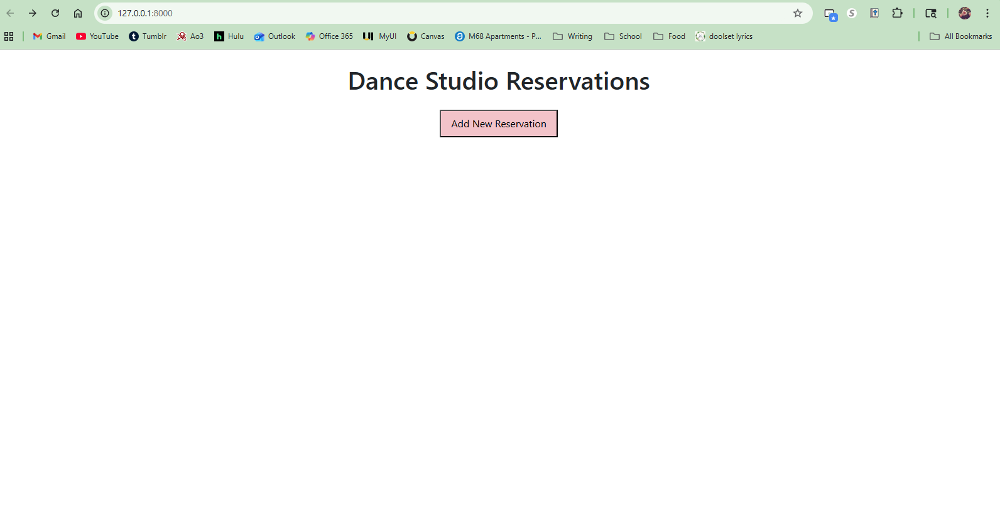
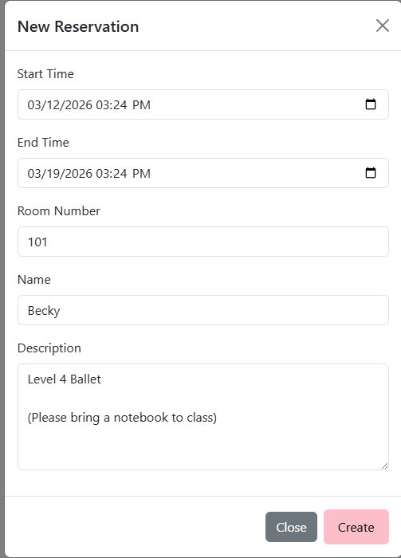
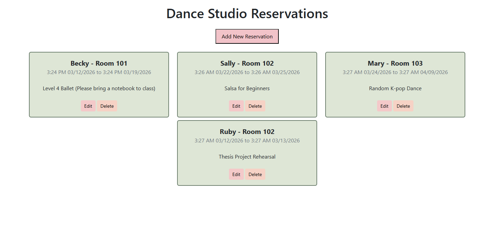
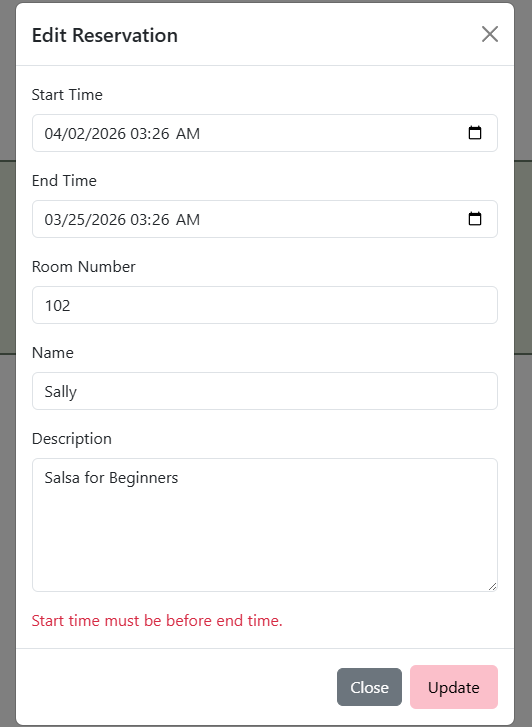
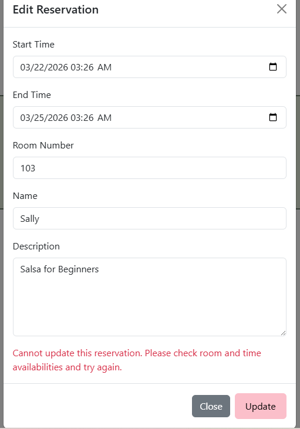

# Dance Studio Reservation App

This project is a simple web application built using **FastAPI** for the backend and **HTML/CSS/JavaScript** for the frontend, 
with **XMLHttpRequest** for frontend-backend communication (via API endpoints at /Reservations). It allows users to manage dance studio room reservations with **basic CRUD operations**. 

All data is stored in an in-memory list, so it resets when the server restarts. Bootstrap was used to create buttons and various modals. 

Files, along with screenshots of the the web application are included below with documentation.

## Web App Features
- **Create reservations**: Add new reservations with start time, end time, room number, name, and description.
- **Read reservations**: View all existing reservations, sorted by start time and room number.
- **Update reservations**: Edit an existing reservation.
- **Delete reservations**: Delete and remove a reservation.

Various validation rules and constraints are also included: 
All fields on the create/edit forms need to be filled out, start time should be before the end time, and reservation room and times can't overlap with one another.

## Repository Structure
- `README.md` - Project documentation
- `frontend/`
  - `favicon.ico` - a favicon of a woman dancing
  - `index.html` - Main HTML page for the web structure and interface  
  - `main.js` - JavaScript file for frontend interactions and API calls  
  - `style.css` - CSS file for styling the page and buttons  

- `main.py` - FastAPI application
- `reservation.py` - Reservation model using Pydantic
- `reservation_routes.py` - FastAPI CRUD routes
- `requirements.txt` - Python dependencies

- `screenshots/` - Various images of the web application
  - `homepage.png` - Image of the home page, before any CRUD operations  
  

  - `new_reservation.png` - Image of the form to create reservation, after clicking `Add New Reservation`  
  
    

  - `create_output.png` - Image of what the page looks like after creating room reservations  
                                                                                               

    
  - `edit_time_error.png` - Image of the form to edit a reservation, including an error message regarding nonsensical time slots. 
  

    
  - `edit_time_overlap.png` - Image of the form to edit a reservation, including an error message regarding overlapping time slots 
  
 
    
